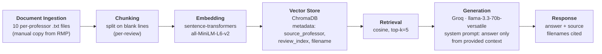

# Project 1 Planning: The Unofficial Guide

> Write this document before you write any pipeline code.
> Your spec and architecture diagram are what you'll use to direct AI tools (Claude, Copilot, etc.) to generate your implementation — the more specific they are, the more useful the generated code will be.
> Update the Retrieval Approach and Chunking Strategy sections if you change your approach during implementation.
> Update this file before starting any stretch features.

---

## Domain

Student reviews of UCSD Computer Science & Engineering (CSE) professors, collected from individual RateMyProfessors profiles. Official UCSD sources — the course catalog, CSE faculty pages, and even CAPE — describe what a course covers and what a professor researches, but say very little about teaching style, exam difficulty, grading harshness, or how a professor actually treats students day to day. Reviews on RateMyProfessors fill that gap, but they sit one professor per page with no way to ask cross-cutting questions like "which CSE professor is best for an intro class?" or "who gives the heaviest workload?" — which is exactly the gap this system is meant to close.

The system should be able to answer questions like:
1. "What do students say about Niema Moshiri's exams and workload?"
2. "Is Joseph Pasquale a good professor for OS-style classes?"
3. "Which UCSD CSE professors are described as caring or approachable in office hours?"
4. "Which professors are flagged as tough graders or having heavy homework?"
5. "What do students think of Rose Yu's lecture style?"

---

## Documents

Ten RateMyProfessors profile pages for UCSD CSE faculty. Each page is a thread of dated student reviews (rating, difficulty, tags, free-text comments) for one professor, which gives the system a per-professor "voice" and lets retrieval surface cross-cutting patterns across professors.

| # | Source | Description | URL or location |
|---|--------|-------------|-----------------|
| 1 | RateMyProfessors — Julian McAuley | UCSD CSE faculty; ML / recommender systems; reviews discuss fairness, lecture style, workload | https://www.ratemyprofessors.com/professor/2070821 |
| 2 | RateMyProfessors — Joseph Pasquale | UCSD CSE faculty; OS / networking; long history of reviews spanning many quarters | https://www.ratemyprofessors.com/professor/528482 |
| 3 | RateMyProfessors — Rose Yu | UCSD CSE faculty; ML; reviews focus on lecture clarity and office hours | https://www.ratemyprofessors.com/professor/2879115 |
| 4 | RateMyProfessors — Daniele Micciancio | UCSD CSE faculty; cryptography / theory; reviews split between "caring" and "very difficult" | https://www.ratemyprofessors.com/professor/449659 |
| 5 | RateMyProfessors — Hao Su | UCSD CSE faculty; computer vision / graphics; reviews discuss curves and exam difficulty | https://www.ratemyprofessors.com/professor/2446901 |
| 6 | RateMyProfessors — Joseph Politz | UCSD CSE teaching faculty; intro programming / PL; reviews discuss handouts and weekly workload | https://www.ratemyprofessors.com/professor/2284684 |
| 7 | RateMyProfessors — Gary Gillespie | UCSD CSE teaching faculty; reviews flag heavy homework and tough grading | https://www.ratemyprofessors.com/professor/63531 |
| 8 | RateMyProfessors — Niema Moshiri | UCSD CSE associate teaching professor; computational biology; teaches intro CS courses | https://www.ratemyprofessors.com/professor/2279559 |
| 9 | RateMyProfessors — Mia Minnes | UCSD CSE teaching professor; vice-chair undergrad ed; theory courses; reviews discuss approachability | https://www.ratemyprofessors.com/professor/1516842 |
| 10 | RateMyProfessors — Paul Cao | UCSD CSE lecturer; intro CS; reviews discuss lecture clarity and student support | https://www.ratemyprofessors.com/professor/2772323 |

---

## Chunking Strategy

**Chunk size:** Variable — **one chunk per review**, with a hard cap of ~800 characters. Typical chunks land between 50 and 400 characters. If a single review exceeds the cap (rare on RMP), split on the nearest sentence boundary.

**Overlap:** 0 characters.

**Reasoning:** An RMP review is the natural retrieval unit. Each review is a self-contained opinion from one student about one professor at one point in time, usually 1–3 sentences. Two consequences fall out of this:

- **Don't split within a review.** A fixed 200-char splitter would cut "Professor Moshiri's midterms are heavy but fair" between "heavy" and "but fair," destroying meaning. Per-review chunking preserves the smallest unit that's independently answerable.
- **Don't overlap across reviews.** Overlap is for capturing a thought that spans a paragraph boundary in long-form text. In a review corpus, the boundary *is* a topic change (different student, different quarter, possibly different course). Overlap would smear one student's opinion into another's chunk and pollute retrieval.

To make per-review splitting work, raw documents will be normalized at ingest so each review is separated by a blank line — splitting on `\n\n` then becomes the chunker. Each chunk carries metadata: `source_professor` (e.g., `"niema_moshiri"`), `review_index` (position within that professor's file), and the source filename for citation.

Expected chunk count: 10 professors × ~20–30 reviews each ≈ **200–300 chunks** total. Comfortably inside the 50–2000 range the spec calls healthy.

---

## Retrieval Approach

**Embedding model:** `all-MiniLM-L6-v2` via `sentence-transformers` (384-dim, 256-token context, runs locally on CPU).

**Top-k:** 5.

**Reasoning on top-k:** Many useful queries here are comparative ("which professor is best for intro CS?") and need evidence from *different* professors' reviews, not three near-duplicates from the same page. k=5 gives the LLM enough breadth to compare while staying tight enough that the prompt isn't drowned in marginally-relevant chunks. If retrieval distance scores during Milestone 4 are consistently > 0.5 on the top result, I'll revisit k upward; if the LLM is being pulled off-topic by chunk 4 or 5, I'll revisit downward.

**Production tradeoff reflection:** If cost weren't a constraint and this were going to real students, I'd consider:

- **OpenAI `text-embedding-3-small`** (1536-dim) — meaningfully higher MTEB performance and an 8k context window, so even longer reviews embed cleanly. Costs ~$0.02/1M tokens, which is trivial at the scale of a per-school RAG.
- **Multilingual support** — irrelevant for RMP (English-only), but if the source ever expanded to e.g. campus Discord or international student forums, `intfloat/multilingual-e5-large` would matter.
- **Domain-tuned vs. general** — student-review language is full of slang ("rip," "carry," "GOAT") and course code shorthand ("CSE 100 with him is mid"). A small fine-tune on collected RMP data could meaningfully improve same-domain retrieval, but only if the scale justifies the engineering.
- **Local vs. API** — MiniLM local has no rate limits and no privacy concerns. Hosted embeddings add latency on every query (typically ~100ms round-trip) but free up local CPU. For an MVP this isn't worth the trade.
- **Context length** — MiniLM truncates at 256 tokens (~1000 chars). For per-review chunks that's not a problem, but if I later move to per-paragraph chunks of long-form guides, the truncation would silently drop content.

---

## Evaluation Plan

Each question below has an answer that should be derivable from the reviews on the cited professor's RMP page (which is what the system will be indexing). "Correct" means the system surfaces the gist of what reviews actually say — not that it reproduces any single quote verbatim.

| # | Question | Expected answer |
|---|----------|-----------------|
| 1 | What do students say about Joseph Politz's weekly workload? | Heavy weekly load — roughly 20 programming problems per week on top of tests and assignments; reviewers describe it as time-consuming. Source: `joseph_politz.txt`. |
| 2 | Which UCSD CSE professor is described as one of the most caring even though their exams and homework are difficult? | Daniele Micciancio. Reviews split: some students call him among the most caring at UCSD and praise how closely he listens to questions; others flag hard homework and exams with no curve. Source: `daniele_micciancio.txt`. |
| 3 | What's the main complaint students have about Rose Yu's lectures? | Lectures are described as confusing; she doesn't annotate on the slides while teaching; reviewers also mention canceled office hours without warning. Source: `rose_yu.txt`. |
| 4 | Is Julian McAuley considered a fair grader, and what do students think of his lectures? | Yes — reviews consistently praise his fairness, call his lectures informative and funny, and describe the class as manageable with effort. Source: `julian_mcauley.txt`. |
| 5 | What's the recurring critique of Joseph Pasquale in his reviews? | Mixed picture: some reviews call him one of the best professors at UCSD and praise how he makes the material interesting; others note that he avoids helping with assignments and teaches primarily on Zoom. Source: `joseph_pasquale.txt`. |

A grader can check each system response against the named source file. For Milestone 5 I'll also include one **out-of-scope** probe ("What's the best burrito near UCSD?") to confirm the grounding instruction makes the system refuse rather than fabricate.

---

## Anticipated Challenges

1. **RMP is JavaScript-rendered, so naive scraping (`requests`/`urllib`) returns near-empty HTML.** Real review text is loaded client-side. Practical mitigation: copy reviews manually into per-professor `.txt` files with a blank line between each review. This is slow but reliable, and it sidesteps the JS-rendering rabbit hole the spec explicitly warns about. As a stretch, I could try Playwright in headless mode — but the manual approach is enough for 10 professors.

2. **Reviews are very short (often 1–3 sentences), so each chunk's embedding carries little semantic signal individually.** This hurts comparative queries — when a student asks "which CSE professor is best for intro CS?", no single review answers that question, so retrieval has to surface several short reviews from several different professors and rely on the LLM to synthesize. The risk: top-k of short chunks tends to cluster on surface-level word overlap rather than semantic intent. Mitigation: keep k=5 so we get cross-professor breadth, and make sure metadata is solid so the LLM can name *which* professor each retrieved chunk is about.

3. **Professors are referenced inconsistently inside reviews** — "Niema," "Professor Moshiri," "he," "the prof," etc. An embedding of a review that just says "she canceled office hours" carries no signal about which professor it's referring to. Mitigation: attach `source_professor` as a metadata field on every chunk at ingest time, derived from the filename — never rely on the chunk text alone to identify the subject. This also means citations in the generated answer can reliably name the right professor.

4. **RMP review distribution is bimodal** — students who post are usually either very pleased or very angry, with the silent majority not posting at all. Queries that ask for an "average" or "general" opinion may be answered using outlier reviews. This isn't fixable in retrieval; the right move is to acknowledge it in the README's limitations section and in the failure-case writeup.

---

## Architecture

Each stage label names the concrete tool I'll prompt AI to wire up in the corresponding milestone, so the diagram itself is what I'll paste into AI prompts later.

---

## AI Tool Plan

I'll use **Claude Code (Sonnet/Opus)** for all three implementation milestones because it can read this `planning.md` directly and operate on the repo, rather than copying snippets back and forth from a chat window. The plan for each milestone:

**Milestone 3 — Ingestion and chunking:**

- *Input I'll give it:* the Documents and Chunking Strategy sections above, the architecture diagram, plus one sample raw `.txt` file as a concrete reference for what the input looks like.
- *What I expect it to produce:* `ingest.py` that loads every `.txt` file in `documents/`, strips any leftover boilerplate (URLs, "Report this rating" footers, navigation breadcrumbs from copy-paste), splits on `\n\n` into per-review chunks, and emits a list of `{text, source_professor, review_index, source_file}` dicts. Plus a small print routine that dumps 5 random chunks for inspection.
- *How I'll verify:* run the print routine, eyeball that each chunk reads like a single complete review tied to the right professor, count total chunks (expect 200–300), and check no chunk is empty or under ~20 chars. If any of those fail, I'll fix the splitter before moving on.

**Milestone 4 — Embedding and retrieval:**

- *Input I'll give it:* the Retrieval Approach section, the architecture diagram, and a sample of the chunked output from Milestone 3.
- *What I expect it to produce:* `embed.py` that loads the chunks, embeds them with `SentenceTransformer("all-MiniLM-L6-v2")`, and stores them in a persistent ChromaDB collection along with the metadata fields. Plus a `retrieve(query, k=5)` function that returns the top-k chunks with their metadata and distance scores.
- *How I'll verify:* run `retrieve()` on evaluation questions 1, 3, and 4 from the plan above. Each one should return at least one chunk visibly relevant to the question, top-1 distance below 0.5, and the metadata should correctly name the professor. If the top result is the wrong professor, I'll debug the metadata pipeline before generation.

**Milestone 5 — Generation and interface:**

- *Input I'll give it:* the full `planning.md`, sample `retrieve()` output from Milestone 4, and the Gradio skeleton from the spec.
- *What I expect it to produce:* `query.py` exposing an `ask(question)` function that calls `retrieve()`, formats the chunks into a context block, sends a Groq `llama-3.3-70b-versatile` request with a strict "answer only from the provided context; if it doesn't cover the question, say so" system prompt, and returns `{answer, sources}` where `sources` is the deduped list of source filenames from the retrieved chunks. Plus an `app.py` Gradio interface around it.
- *How I'll verify:* run an in-scope question (eval question 2 — Micciancio) and confirm the answer cites `daniele_micciancio.txt`; run an out-of-scope question ("What's the best burrito near UCSD?") and confirm the system declines rather than hallucinates. I'll read the actual system prompt the AI generates — grounding has to be enforced by the prompt, not just suggested.
